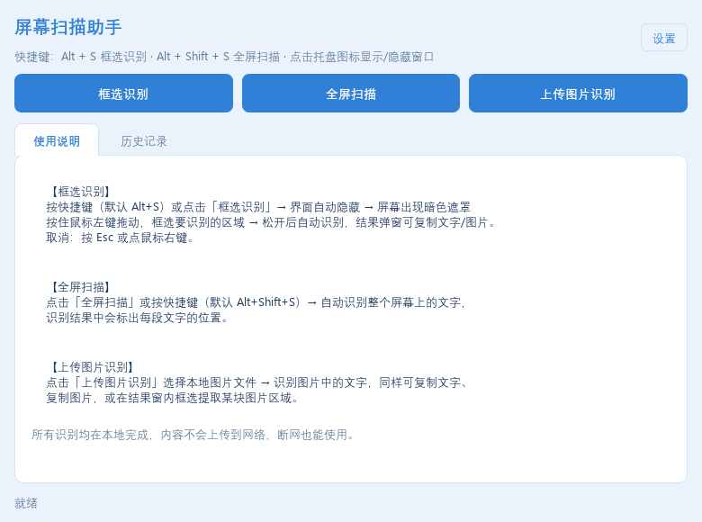
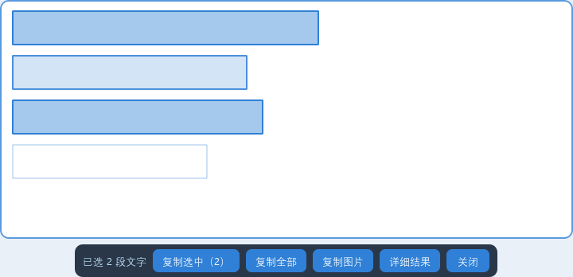
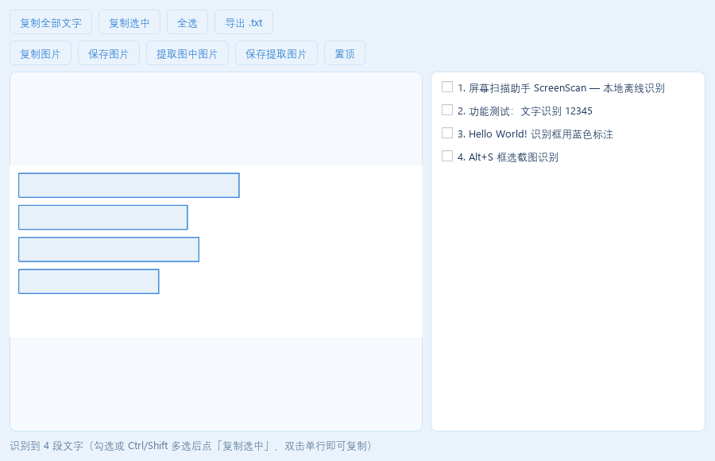

# 屏幕扫描助手 — 使用说明（图文版）

> 一款常驻后台的屏幕识别小工具：按快捷键框选屏幕区域（或上传图片），自动识别其中的**文字与图片**，一键复制。
> 全部识别在**本地离线**完成，内容不上传网络，断网可用。

## 一、安装

**无需安装**：双击 `屏幕扫描助手.exe` 即可使用（首次启动约 1~3 秒加载识别引擎）。

> 若被杀毒软件拦截，选择「信任/允许」即可；如遇误报可重新下载文件夹版。

## 二、主界面

- **框选识别**：按 `Alt+S`，屏幕变暗后按住左键拖动框选要识别的区域
- **全屏扫描**：按 `Alt+Shift+S`，一键识别整个屏幕
- **上传图片识别**：选择本地图片（png/jpg/webp 等），识别其中的文字
- **设置**：修改快捷键、置顶开关、开机自启
- **历史记录**：最近 50 次识别记录，双击可回看
- 左下角是状态提示；单击托盘图标可显示/隐藏主窗口

## 三、框选识别（最常用）

1. 按 `Alt+S`（主窗口会隐藏，屏幕变暗出现十字线）
2. 按住鼠标左键拖动，框选要识别的区域（底部有操作提示）
3. 松开鼠标 → **截图立刻留在屏幕上**（顶部显示「正在识别…」，不用切回软件窗口）
4. 识别完成 → 同一位置**原地变成可交互面板**：文字带蓝色高亮框，点击/框选即可复制
5. 取消：按 `Esc` 或点鼠标右键

## 四、屏幕浮层：识别后直接选字复制

识别完成后，截图原位置会出现结果浮层，文字上带蓝色高亮框；**操作条在框选区域外面**（下方优先，下方放不下则在上方），所以再小的区域也不会被遮住：

| 操作 | 说明 |
|------|------|
| 单击某段文字 | 选中该段（再点一次取消） |
| `Ctrl` + 单击 | 追加选中多段 |
| 拖拽框选 | 一次选中框到的所有文字段 |
| `Ctrl+A` / `回车` | 全选 / 复制已选文字 |
| 「复制选中」 | 把选中的文字按原顺序复制到剪贴板 |
| 「复制全部」「复制图片」 | 复制全部文字 / 复制该区域图片 |
| 「详细结果」 | 打开完整结果窗口（多选、导出、抠图） |
| `Esc` / 「关闭」 | 关闭浮层 |
| **拖拽面板边缘或右下角** | 调整面板大小（等比缩放，文字和识别框始终对齐，不会变形） |

## 五、识别结果窗

- 右侧文字列表：**勾选或 `Ctrl`/`Shift` 多选**多段文字 → 点「复制选中」批量复制；「全选 / 取消全选」一键切换；双击单行复制该行
- 「复制全部文字」/`Ctrl+C`：整段文字；「导出 .txt」：有勾选时只导出选中的文字
- 「复制图片」「保存图片」：区域截图/上传图片本身
- 「提取图中图片」：开启后在左侧图片上**再框选一块**，松手即把该小块图片复制到剪贴板；之后可「保存提取图片」存为 png
- 「置顶」：结果窗钉在最上层（默认开启，可在设置中关闭）

- 左侧图片上的蓝色框 = 识别到的文字位置

## 六、设置

主窗口右上角「设置」：

- **快捷键**：两个热键均可改（支持 Alt/Ctrl/Shift/Win 组合与 F1-F12，写法示例 `ctrl+alt+s`、`f9`）
- **结果窗自动置顶**：开关
- **开机自动启动**：开关

## 七、数据与隐私

- 设置与历史保存在本机：`%LOCALAPPDATA%\ScreenScan\`
- 不做任何网络上传；删除该文件夹即可清除全部数据

## 八、常见问题

| 现象 | 处理 |
|------|------|
| 快捷键无反应 | 可能与其他软件冲突 → 设置里换一个热键 |
| 识别不准确 | 框选范围大一些；避免手写/艺术字/极小的字 |
| 截不到某些窗口 | UAC 管理员弹窗、部分独占全屏游戏无法截取（系统限制） |
| 开机自启未生效 | 检查是否被安全软件拦截；重新开关一次 |
| 如何升级 | 直接替换 exe 文件即可（设置与历史自动保留） |
